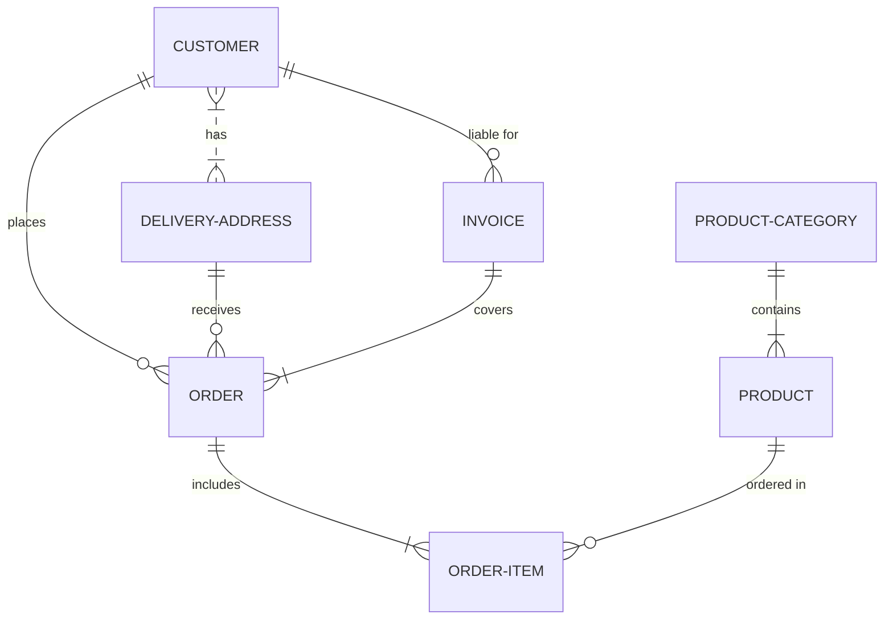
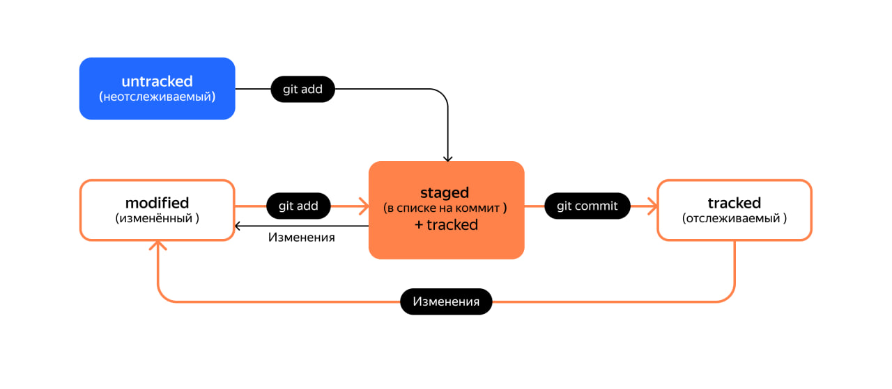

# Git список команд
----
### Bash
* **pwd** -- путь текущей директории
* **сd "Путь к директории"** -- сменить директорию на "..."
* **ls** -- список файлов в директории
* **touch** -- создание файлов
* **mkdir** -- создать директорию
```bash

cd ~ #Перейти к домашней директории


ls #Посмотреть список файлов директории
```
### Git
* **git init** -- инициировать репозиторий в текущей директории
* **rm -rf .git** -- разгитить репозиторий
* **git status** -- проверить состояние репозитория
* **git add --all** -- подготовить файлы в репозитории к сохраниению
* **git commit -m "сообщение"** -- закоммитить текущее состояние репозитория
* **git log** -- посмотреть журнал коммитов
Как синхронизировать репозиторий с GitHub смотри [здесь](https://practicum.yandex.ru/profile/git-basics/)
* **git push -u original master** -- первая синхронизация с GitHub
* **git push** --все дальнейшие синхронизации


### Пример диаграммы
----

* **HEAD** -- указывает на головной файл, который хранится в .git
### Статусы
* **modified + git add = staged**
